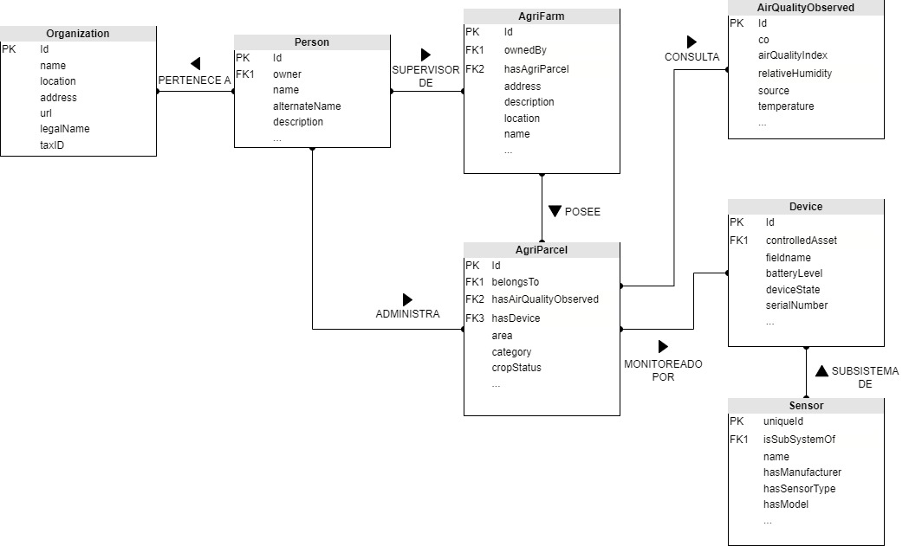
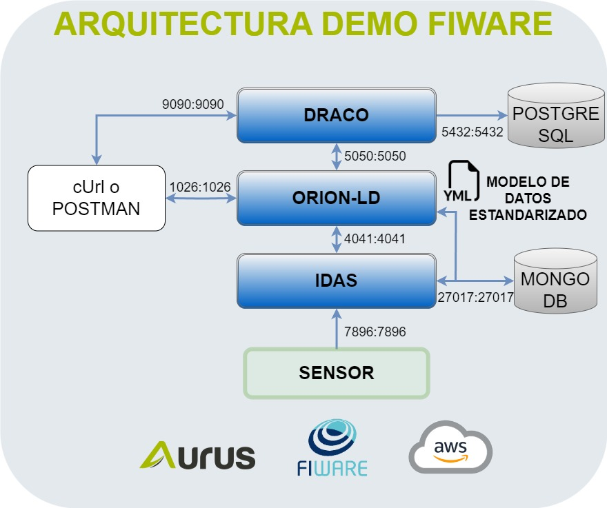

# FIWARE Demo Repository

Este repositorio contiene un proyecto de demostración que muestra las capacidades de FIWARE presentado en el evento AWS UG Conf 2023. Los usuarios pueden desplegar fácilmente los servicios de FIWARE utilizando contenedores Docker. Los servicios incluidos en esta demo son Orion-ld, IoT Agent for JSON, Draco, una base de datos MongoDB y una PostgreSQL. La demo simula una granja con su campo siendo monitoreado por un dispositivo equipado con sensores de temperatura y humedad.

## Modelo de Datos

El modelo de datos para este proyecto está representado en el siguiente diagrama:



Este diagrama incluye las siguientes entidades:

- Organization: Almacena información sobre la empresa que gestiona la granja.
- Person: Representa al supervisor de la granja.
- AgriFarm: Representa la granja en sí.
- AgriParcel: Representa las parcelas individuales dentro de la granja.
- AirQualityObserved: Contiene parámetros de calidad del aire para el área donde se encuentra la parcela, que se pueden obtener de fuentes externas.
- Device: Representa el dispositivo de monitoreo responsable de medir la temperatura y la humedad en las parcelas.
- Sensor: Se refiere al sensor de temperatura o humedad.

Los modelos de datos abiertos elegidos para esta demo son los siguientes:

[https://raw.githubusercontent.com/smart-data-models/dataModel.Device/master/context.jsonld](https://raw.githubusercontent.com/smart-data-models/dataModel.Device/master/context.jsonld)
[https://raw.githubusercontent.com/smart-data-models/dataModel.Environment/master/context.jsonld](https://raw.githubusercontent.com/smart-data-models/dataModel.Environment/master/context.jsonld)
[https://raw.githubusercontent.com/smart-data-models/dataModel.OCF/master/context.jsonld](https://raw.githubusercontent.com/smart-data-models/dataModel.OCF/master/context.jsonld)
[https://raw.githubusercontent.com/smart-data-models/dataModel.Agrifood/master/context.jsonld](https://raw.githubusercontent.com/smart-data-models/dataModel.Agrifood/master/context.jsonld)
[https://raw.githubusercontent.com/smart-data-models/dataModel.Organization/master/context.jsonld](https://raw.githubusercontent.com/smart-data-models/dataModel.Organization/master/context.jsonld)
[https://raw.githubusercontent.com/smart-data-models/dataModel.SAREF/master/context.jsonld](https://raw.githubusercontent.com/smart-data-models/dataModel.SAREF/master/context.jsonld)

Estos modelos de datos se agregan en la sección __iot-agent__ del archivo __docker-compose.yml__

## Arquitectura

La arquitectura de los componentes de FIWARE para esta demo está representado en el siguiente diagrama:



Esta arquitectura está conformada por:

- ORION-LD: Componente principal de toda plataforma Powered by Fiware. Se encarga de la gestión de las Entidades, relaciones y se conecta a todos los demás componentes de manera estandarizada por NGSI-LD. Usa una base de datos MongoDB. Este componente es administrado por el puerto 1026.
- IDAS: También llamado IoT Agent. Para esta demo se utiliza el tipo Json. Este componente se encarga de traducir una trama Json al estándar NGSI-LD para que pueda ser interpretada por ORION-LD. Usa una base de datos MongoDB. Este componente es administrado por el puerto 4041 y recibe la trama Json de los dispositivos por el puerto 7896.
- DRACO: Es el componente que permite conectarse a una base de datos de históricos, ya que ORION-LD solo almacena valores instáneos. Para la demo se conecta a una BD PostgreSQL por el puerto 5432. Este contenedor usa los puertos 5050 para suscribirse a ORION-LD y 9090 para la UI de configuración de la base de datos.
- SENSOR: Es el dispositivo que envía los datos de los sensores al IDAS en formato JSON, puede ser uno o varios sensores y, para esta demo, enviará los datos por el protocolo http.
- POSTGRESQL: Almacena los datos históricos en una tabla del mismo nombre que la entidad, en este caso Sensor.
- MONGODB: Base de datos en donde se almacena toda la información de ORION-LD y el IDAS. Normalmente no se interactúa con esta base de datos. Acepta conexiones por el puerto 27017.

## Requisitos Previos

Antes de ejecutar la demo, se recomienda crear una instancia de AWS de tipo t2.small con al menos 20GB de almacenamiento.

## Procedimiento de Instalación

Para configurar y ejecutar la demo, siga estos pasos:

1. Clone este repositorio en su máquina local:

   ```bash
   git clone https://github.com/kevinGmezIoT/AWSUG2023-FiwareDemo.git
   ```
2. Navegue al directorio del proyecto:
   ```bash
   cd AWSUG2023-FiwareDemo
   ```
3. Cambie al usuario root (sudo):
   ```bash
   sudo su
   ```
4. Ejecute el script de instalación (Instalará Docker):
   ```bash
   bash installation.sh
   ```
5. Inicie los contenedores de Docker:
   ```bash
   docker compose up
   ```
Para que se ejecuten en segundo plano:
   ```bash
   docker compose up -d
   ```
Para detener los contenedores:
   ```bash
   docker compose stop
   ```