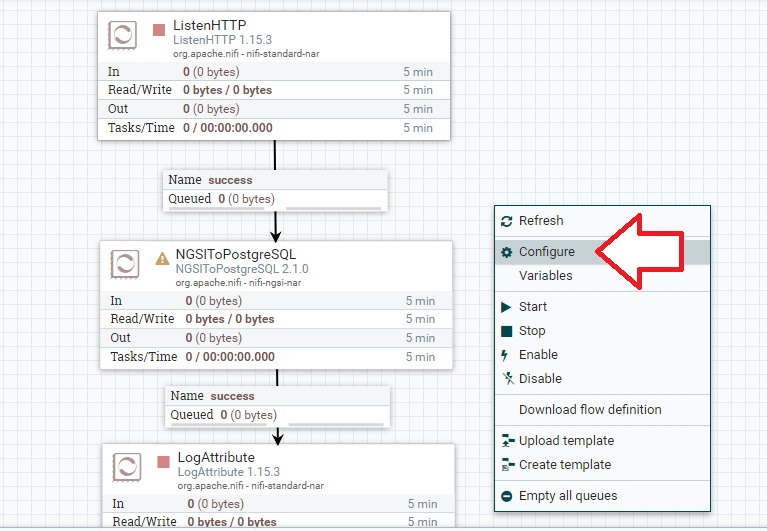
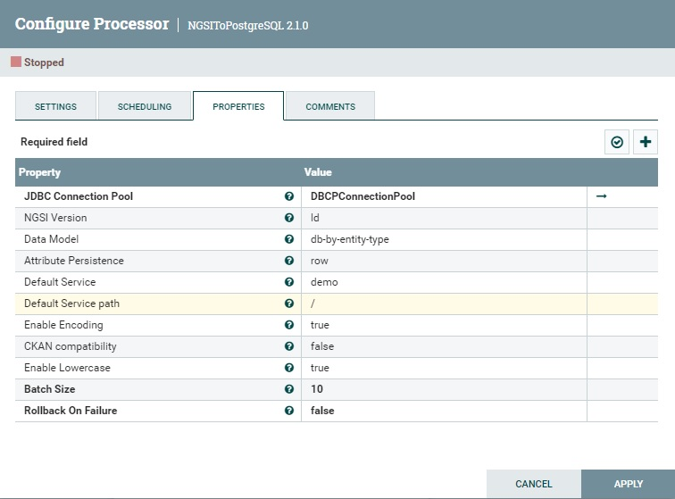

# FIWARE Demo Repository

Este repositorio contiene un proyecto de demostración que muestra las capacidades de FIWARE. Los usuarios pueden desplegar fácilmente los servicios de FIWARE utilizando contenedores Docker. Los servicios incluidos en esta demo son Orion-ld, IoT Agent for JSON, Draco, una base de datos MongoDB y una PostgreSQL. La demo simula una granja con su campo siendo monitoreado por un dispositivo equipado con sensores de temperatura y humedad.

## Modelo de Datos

El modelo de datos para este proyecto está representado en el siguiente diagrama:


Este diagrama incluye las siguientes entidades:

- Organization: Almacena información sobre la empresa que gestiona la granja.
- Person: Representa al supervisor de la granja.
- AgriFarm: Representa la granja en sí.
- AgriParcel: Representa las parcelas individuales dentro de la granja.
- AirQualityObserved: Contiene parámetros de calidad del aire para el área donde se encuentra la parcela, que se pueden obtener de fuentes externas.
- Device: Representa el dispositivo de monitoreo responsable de medir la temperatura y la humedad en las parcelas.
- Sensor: Se refiere al sensor de temperatura o humedad.

Los modelos de datos abiertos elegidos para esta demo son los siguientes:

[https://raw.githubusercontent.com/smart-data-models/dataModel.Device/master/context.jsonld](https://raw.githubusercontent.com/smart-data-models/dataModel.Device/master/context.jsonld)
[https://raw.githubusercontent.com/smart-data-models/dataModel.Environment/master/context.jsonld](https://raw.githubusercontent.com/smart-data-models/dataModel.Environment/master/context.jsonld)
[https://raw.githubusercontent.com/smart-data-models/dataModel.OCF/master/context.jsonld](https://raw.githubusercontent.com/smart-data-models/dataModel.OCF/master/context.jsonld)
[https://raw.githubusercontent.com/smart-data-models/dataModel.Agrifood/master/context.jsonld](https://raw.githubusercontent.com/smart-data-models/dataModel.Agrifood/master/context.jsonld)
[https://raw.githubusercontent.com/smart-data-models/dataModel.Organization/master/context.jsonld](https://raw.githubusercontent.com/smart-data-models/dataModel.Organization/master/context.jsonld)
[https://raw.githubusercontent.com/smart-data-models/dataModel.SAREF/master/context.jsonld](https://raw.githubusercontent.com/smart-data-models/dataModel.SAREF/master/context.jsonld)

Estos modelos de datos se agregan en la sección __iot-agent__ del archivo __docker-compose.yml__

## Arquitectura

La arquitectura de los componentes de FIWARE para esta demo está representado en el siguiente diagrama:


Esta arquitectura está conformada por:

- ORION-LD: Componente principal de toda plataforma Powered by Fiware. Se encarga de la gestión de las Entidades, relaciones y se conecta a todos los demás componentes de manera estandarizada por NGSI-LD. Usa una base de datos MongoDB. Este componente es administrado por el puerto 1026.
- IDAS: También llamado IoT Agent. Para esta demo se utiliza el tipo Json. Este componente se encarga de traducir una trama Json al estándar NGSI-LD para que pueda ser interpretada por ORION-LD. Usa una base de datos MongoDB. Este componente es administrado por el puerto 4041 y recibe la trama Json de los dispositivos por el puerto 7896.
- DRACO: Es el componente que permite conectarse a una base de datos de históricos, ya que ORION-LD solo almacena valores instáneos. Está basado en Apache NiFi. Para la demo se conecta a una BD PostgreSQL por el puerto 5432. Este contenedor usa los puertos 5050 para suscribirse a ORION-LD y 9090 para la UI de configuración de la base de datos.
- SENSOR: Es el dispositivo que envía los datos de los sensores al IDAS en formato JSON, puede ser uno o varios sensores y, para esta demo, enviará los datos por el protocolo http.
- POSTGRESQL: Almacena los datos históricos en una tabla del mismo nombre que la entidad, en este caso Sensor.
- MONGODB: Base de datos en donde se almacena toda la información de ORION-LD y el IDAS. Normalmente no se interactúa con esta base de datos. Acepta conexiones por el puerto 27017.

## Requisitos Previos

Antes de ejecutar la demo, se recomienda crear una instancia de AWS de tipo t2.small con al menos 20GB de almacenamiento.
Habilitar los puertos de la imagen:


## Procedimiento de Instalación

Para configurar y ejecutar la demo, siga estos pasos:

1. Clone este repositorio en su máquina local:

   ```bash
   git clone https://github.com/kevinGmezIoT/FiwareDemo_Esp_byKevinG.git
   ```
2. Navegue al directorio del proyecto:
   ```bash
   cd FiwareDemo_Esp_byKevinG.git
   ```
3. Cambie al usuario root (sudo):
   ```bash
   sudo su
   ```
4. Ejecute el script de instalación (Instalará Docker):
   ```bash
   bash installation.sh
   ```
5. Inicie los contenedores de Docker:
   ```bash
   docker compose up
   ```
Para que se ejecuten en segundo plano:
   ```bash
   docker compose up -d
   ```
Para detener los contenedores:
   ```bash
   docker compose stop
   ```

## Configurar NiFi

Para ingresar a la UI nos dirigimos a la dirección: http://<URL-EC2-Instancia>:9090/nifi
Aquí hacemos ubicar el mouse en __Template__ y arrastrar al espacio de trabajo.


Seleccionar ORION-TO-POSTGRESQL.


Se verá un conjunto de bloques. Hacer clic derecho en el espacio de trabajo fuera de los bloques y elegir __Configure__



Ubicarse en la pestaña __CONTROLLER SERVICES__ y luego dar clic en el engranaje.


Luego ingresar a la pestaña PROPERTIES y modificar las propiedades:
- Database Connection URL: Aquí reemplazar correctamente el hostname de la BD
- Database User: Colocar el nombre de usuario de la BD
- Password: Colocar la contraseña de la BD, una vez colocada no se vuelve a mostrar.
Estos valores se colocan de acuerdo a los parámetros en el archivo __.env__


Luego hacer clic en __APPLY__ y hacer clic en el símbolo de rayo al costado del engranaje.
Finalmente hacer clic en __ENABLE__


Salir de todas las ventanas y volver al espacio de trabajo. Aquí hacer clic derecho al bloque central y elegir __Configure__.


Seleccionar la pestaña __PROPERTIES__ y modificar las propiedades:

- NGSI Version: Cambiar de v2 a ld. Esto porque utilizamos NGSI-LD.
- Data Model: Elegir db-by-entity-type. Esto le asignará el nombre de la entidad a la tabla generada.
- Default Service: Colocar __demo__. Este es el nombre de servicio elegido para esta demo.
- Default Service path: Colocar solo /. Este es el path más simple para esta demo.

Finalmente clic en __APPLY__



La última acción en NiFi es seleccionar a los tres bloques más grandes usando la tecla SHIFT y hacer clic en el botón Start como se ve en la figura:


## Manejando los componentes de FIWARE

Los siguientes pasos se pueden realizar en POSTMAN o con comandos cUrl

## Pruebas

Prueba de Orion:
```bash
curl --location 'http://<URL-EC2-Instancia>:1026/version'
```

Prueba de IoT Agent:
```bash
curl --location 'http://<URL-EC2-Instancia>:4041/iot/about'
```

## Pasos para establecer el sistema completo

1. Crear Grupo de Servicio:
```bash
curl --location 'http://<URL-EC2-Instancia>:4041/iot/services' \
--header 'fiware-service: demo' \
--header 'fiware-servicepath: /' \
--header 'Content-Type: application/json' \
--data '{
    "services": [
        {
            "apikey": "f6ad88cb-fbcd-413e-b71e-df3147943718",
            "cbroker": "http://orion:1026",
            "entity_type": "Sensor",
            "resource": "/iot/json"
        }
    ]
}'
```

2. Crear entidad de la Organización:
```bash
curl --location 'http://<URL-EC2-Instancia>:1026/ngsi-ld/v1/entities/' \
--header 'Content-Type: application/ld+json' \
--header 'Accept: application/ld+json' \
--header 'fiware-service: demo' \
--header 'fiware-servicepath: /' \
--data-raw '{
    "id": "urn:ngsi-ld:Organization:organization123456789",
    "type": "Organization",
    "name": {
        "type": "Property",
        "value": "Compañía AgriFood"
    },
    "location": {
        "type": "GeoProperty",
        "value": {
            "type": "Point",
            "coordinates": [
                -12.108167,
                -77.007356
            ]
        }
    },
    "address": {
        "type": "Property",
        "value": {
            "addressCountry": "Peru",
            "addressRegion": "Lima",
            "District": "Surco",
            "postalCode": "15038",
            "streetAddress": "Av. Alfredo Benavides"
        }
    },
    "url": {
        "type": "Property",
        "value": "https://www.example-organization-homepage.com"
    },
    "legalName": {
        "type": "Property",
        "value": "Agrifood Inc."
    },
    "taxID": {
        "type": "Property",
        "value": "123456789"
    },
    "@context": [
        "https://raw.githubusercontent.com/smart-data-models/dataModel.Organization/master/context.jsonld"
    ]

}'
```

3. Crear entidad de Supervisor:
```bash
curl --location 'http://<URL-EC2-Instancia>:1026/ngsi-ld/v1/entities/' \
--header 'Content-Type: application/ld+json' \
--header 'Accept: application/ld+json' \
--header 'fiware-service: demo' \
--header 'fiware-servicepath: /' \
--data-raw '{
    "id": "urn:ngsi-ld:Person:person123456789",
    "type": "Person",
    "name": {
        "type": "Property",
        "value": "123456789"
    },
    "alternateName": {
        "type": "Property",
        "value": "Supervisor Granja 123456789"
    },
    "description": {
        "type": "Property",
        "value": "Supervisor de Granja 123456789"
    },
    "location": {
        "type": "GeoProperty",
        "value": {
            "type": "Point",
            "coordinates": [
                -12.108167,
                -77.007356
            ]
        }
    },
    "address": {
        "type": "Property",
        "value": {
            "addressCountry": "Peru",
            "addressRegion": "Lima",
            "District": "Surco",
            "postalCode": "15038",
            "streetAddress": "Av. Alfredo Benavides"
        }
    },
    "areaServed": {
        "type": "Property",
        "value": "Sudamérica"
    },
    "givenName": {
        "type": "Property",
        "value": "Felipe"
    },
    "additionalName": {
        "type": "Property",
        "value": "Ignacio"
    },
    "familyName": {
        "type": "Property",
        "value": "Vera Cruzado"
    },
    "telephone": {
        "type": "Property",
        "value": "+51974153334"
    },
    "email": {
        "type": "Property",
        "value": "info@agrifood.inc"
    },
    "owner":{
        "type": "Relationship",
        "object": "urn:ngsi-ld:Organization:organization123456789"
    },
    "@context": [
    "https://raw.githubusercontent.com/smart-data-models/dataModel.Organization/master/context.jsonld"
    ]
}'
```

4. Crear entidad de la granja:
```bash
curl --location 'http://<URL-EC2-Instancia>:1026/ngsi-ld/v1/entities/' \
--header 'Content-Type: application/ld+json' \
--header 'Accept: application/ld+json' \
--header 'fiware-service: demo' \
--header 'fiware-servicepath: /' \
--data-raw '{
    "id": "urn:ngsi-ld:AgriFarm:agrifarm1234",
    "type": "AgriFarm",
    "address": {
        "type": "Property",
        "value": {
            "addressCountry": "Peru",
            "addressRegion": "Lima",
            "District": "Surco",
            "postalCode": "15038",
            "streetAddress": "Av. Alfredo Benavides"
        }
    },
    "description": {
        "type": "Property",
        "value": "Granja de producción de uvas"
    },
    "hasAgriParcel": {
        "type": "Relationship",
        "object": [
            "urn:ngsi-ld:AgriParcel:agriparcel1234",
            "urn:ngsi-ld:AgriParcel:agriparcel1235"
        ]
    },
    "landLocation": {
        "type": "GeoProperty",
        "value": {
            "type": "Polygon",
            "coordinates": [
                [
                    [
                        100,
                        0
                    ],
                    [
                        101,
                        0
                    ],
                    [
                        101,
                        1
                    ],
                    [
                        100,
                        1
                    ],
                    [
                        100,
                        0
                    ]
                ]
            ]
        }
    },
    "location": {
        "type": "GeoProperty",
        "value": {
            "type": "Point",
            "coordinates": [
                -12.108167,
                -77.007356
            ]
        }
    },
    "name": {
        "type": "Property",
        "value": "Granja principal"
    },
    "ownedBy": {
        "type": "Relationship",
        "object": "urn:ngsi-ld:Person:person123456789"
    },
    "seeAlso": {
        "type": "Property",
        "value": [
            "https://example.org/concept/farm",
            "https://datamodel.org/example/farm"
        ]
    },
    "@context": [
        "https://uri.etsi.org/ngsi-ld/v1/ngsi-ld-core-context.jsonld",
        "https://raw.githubusercontent.com/smart-data-models/dataModel.Agrifood/master/context.jsonld"
    ]
}'
```

5. Crear entidad de la parcela:
```bash
curl --location 'http://<URL-EC2-Instancia>:1026/ngsi-ld/v1/entities/' \
--header 'Content-Type: application/ld+json' \
--header 'Accept: application/ld+json' \
--header 'fiware-service: demo' \
--header 'fiware-servicepath: /' \
--data-raw '{
    "id": "urn:ngsi-ld:AgriParcel:agriparcel1234",
    "type": "AgriParcel",
    "area": {
        "type": "Property",
        "value": 200
    },
    "belongsTo": {
        "type": "Relationship",
        "object": "urn:ngsi-ld:AgriFarm:agrifarm1234"
    },
    "category": {
        "type": "Property",
        "value": "viñedo"
    },
    "cropStatus": {
        "type": "Property",
        "value": "growing"
    },
    "description": {
        "type": "Property",
        "value": "Spring grapes"
    },
    "hasAirQualityObserved": {
        "type": "Relationship",
        "object": [
        "urn:ngsi-ld:AirQualityObserved:airqualityobserved123"
        ]
    },
    "hasDevice": {
        "type": "Relationship",
        "object": [
        "urn:ngsi-ld:Device:device123456",
        "urn:ngsi-ld:Device:device123457"
        ]
    },
    "lastPlantedAt": {
        "type": "Property",
        "value": {
        "@type": "DateTime",
        "@value": "2023-08-22T10:18:16Z"
        }
    },
    "location": {
        "type": "GeoProperty",
        "value": {
        "type": "Polygon",
        "coordinates": [
            [
            [
                100,
                0
            ],
            [
                101,
                0
            ],
            [
                101,
                1
            ],
            [
                100,
                1
            ],
            [
                100,
                0
            ]
            ]
        ]
        }
    },
    "ownedBy": {
        "type": "Relationship",
        "object": "urn:ngsi-ld:Person:person123456789"
    },
    "@context": [
        "https://raw.githubusercontent.com/smart-data-models/dataModel.Agrifood/master/context.jsonld"
    ]
}'
```

6. Crear entidad de la fuente de Calidad de Aire:
```bash
curl --location 'http://<URL-EC2-Instancia>:1026/ngsi-ld/v1/entities/' \
--header 'Content-Type: application/ld+json' \
--header 'Accept: application/ld+json' \
--header 'fiware-service: demo' \
--header 'fiware-servicepath: /' \
--data-raw '{
    "id": "urn:ngsi-ld:AirQualityObserved:airqualityobserved123",
    "type": "AirQualityObserved",
    "co": {
        "type": "Property",
        "value": 500,
        "unitCode": "GP"
    },
    "coLevel": {
        "type": "Property",
        "value": "moderate"
    },
    "no": {
        "type": "Property",
        "value": 45,
        "unitCode": "GQ"
    },
    "no2": {
        "type": "Property",
        "value": 69,
        "unitCode": "GQ"
    },
    "nox": {
        "type": "Property",
        "value": 139,
        "unitCode": "GQ"
    },
    "so2": {
        "type": "Property",
        "value": 11,
        "unitCode": "GQ"
    },
    "address": {
        "type": "Property",
        "value": {
            "addressCountry": "Peru",
            "addressRegion": "Lima",
            "District": "Surco"
        }
    },
    "airQualityIndex": {
        "type": "Property",
        "value": 65
    },
    "airQualityLevel": {
        "type": "Property",
        "value": "moderate"
    },
    "dateObserved": {
        "type": "Property",
        "value": "2016-03-15T11:00:00/2016-03-15T12:00:00"
    },
    "location": {
        "type": "GeoProperty",
        "value": {
            "type": "Point",
            "coordinates": [
                -12.108167,
                -77.007356
            ]
        }
    },
    "precipitation": {
        "type": "Property",
        "value": 0
    },
    "relativeHumidity": {
        "type": "Property",
        "value": 0.54
    },
    "reliability": {
        "type": "Property",
        "value": 0.7
    },
    "source": {
        "type": "Property",
        "value": "https://www.weatherapi.com/"
    },
    "temperature": {
        "type": "Property",
        "value": 16.2
    },
    "typeOfLocation": {
        "type": "Property",
        "value": "outdoor"
    },
    "windDirection": {
        "type": "Property",
        "value": 186
    },
    "windSpeed": {
        "type": "Property",
        "value": 0.64
    },
    "@context": [
        "https://raw.githubusercontent.com/smart-data-models/dataModel.Environment/master/context.jsonld"
    ]
}'
```

7. Crear entidad del dispositivo:
```bash
curl --location 'http://<URL-EC2-Instancia>:1026/ngsi-ld/v1/entities/' \
--header 'Content-Type: application/ld+json' \
--header 'Accept: application/ld+json' \
--header 'fiware-service: demo' \
--header 'fiware-servicepath: /' \
--data-raw '{
    "id": "urn:ngsi-ld:Device:device123456",
    "type": "Device",
    "batteryLevel": {
        "type": "Property",
        "value": 0.75
    },
    "deviceCategory": {
        "type": "Property",
        "value": [
        "sensor"
        ]
    },
    "controlledAsset": {
        "type": "Relationship",
        "object": [
        "urn:ngsi-ld:AgriParcel:agriparcel1234"
        ]
    },
    "controlledProperty": {
        "type": "Property",
        "value": [
        "humidity",
        "temperature"
        ]
    },
    "deviceState": {
        "type": "Property",
        "value": "ok"
    },
    "ipAddress": {
        "type": "Property",
        "value": [
        "192.168.56.78"
        ]
    },
    "serialNumber": {
        "type": "Property",
        "value": "123456"
    },
    "@context": [
        "https://uri.etsi.org/ngsi-ld/v1/ngsi-ld-core-context.jsonld",
        "https://raw.githubusercontent.com/smart-data-models/dataModel.Device/master/context.jsonld"
    ]
}'
```

8. Inspeccionar que todos los dispositivos se encuentren registrados:
```bash
curl --location 'http://<URL-EC2-Instancia>:1026/ngsi-ld/v1/entities?local=true&options=keyValues' \
--header 'Link: <https://raw.githubusercontent.com/smart-data-models/dataModel.Device/master/context.jsonld>; rel="http://www.w3.org/ns/json-ld#context"; type="application/ld+json", <https://raw.githubusercontent.com/smart-data-models/dataModel.Environment/master/context.jsonld>; rel="http://www.w3.org/ns/json-ld#context"; type="application/ld+json", <https://raw.githubusercontent.com/smart-data-models/dataModel.OCF/master/context.jsonld>; rel="http://www.w3.org/ns/json-ld#context"; type="application/ld+json", <https://raw.githubusercontent.com/smart-data-models/dataModel.Agrifood/master/context.jsonld>; rel="http://www.w3.org/ns/json-ld#context"; type="application/ld+json", <https://raw.githubusercontent.com/smart-data-models/dataModel.Organization/master/context.jsonld>; rel="http://www.w3.org/ns/json-ld#context"; type="application/ld+json", <https://raw.githubusercontent.com/smart-data-models/dataModel.SAREF/master/context.jsonld>; rel="http://www.w3.org/ns/json-ld#context"; type="application/ld+json"' \
--header 'fiware-service: demo' \
--header 'fiware-servicepath: /' \
--data ''
```

9. Aprovisionamiento de los sensores:
```bash
curl --location 'http://<URL-EC2-Instancia>:4041/iot/devices' \
--header 'fiware-service: demo' \
--header 'fiware-servicepath: /' \
--header 'Content-Type: application/json' \
--data '{
  "devices": [
    {
      "device_id": "sensor-temperature-001",
      "entity_name": "urn:ngsi-ld:Sensor:sensor-temperature-001",
      "entity_type": "https://smartdatamodels.org/dataModel.SAREF/Sensor",
      "timezone": "America/Lima",
      "attributes": [
        {
            "object_id": "t",
            "name": "hasSensingRange",
            "type": "Property"
        }
      ],
      "static_attributes": [
        {
            "name": "name",
            "type": "Property",
            "value": "Sensor Temperatura"
        },
        {
            "name": "description",
            "type": "Property",
            "value": "Sensor de temperatura para suelos"
        },
        {
            "name": "hasManufacturer",
            "type": "Property",
            "value": "Maxim Integrated"
        },
        {
            "name": "hasSensorType",
            "type": "Property",
            "value": "Temperatura"
        },
        {
            "name": "hasModel",
            "type": "Property",
            "value": "DS18B20"
        },
        {
            "name": "isSubSystemOf",
            "type": "Relationship",
            "object": "urn:ngsi-ld:Device:device123456"
        }
      ]
    },
    {
      "device_id": "sensor-humidity-001",
      "entity_name": "urn:ngsi-ld:Sensor:sensor-humidity-001",
      "entity_type": "https://smartdatamodels.org/dataModel.SAREF/Sensor",
      "timezone": "America/Lima",
      "attributes": [
        {
            "object_id": "h",
            "name": "hasSensingRange",
            "type": "Property"
        }
      ],
      "static_attributes": [
        {
            "name": "name",
            "type": "Property",
            "value": "Sensor Humedad"
        },
        {
            "name": "description",
            "type": "Property",
            "value": "Sensor de humedad para suelos"
        },
        {
            "name": "hasManufacturer",
            "type": "Property",
            "value": "Texas Instrument"
        },
        {
            "name": "hasSensorType",
            "type": "Property",
            "value": "Humedad"
        },
        {
            "name": "hasModel",
            "type": "Property",
            "value": "FC-28"
        },
        {
            "name": "isSubSystemOf",
            "type": "Relationship",
            "object": "urn:ngsi-ld:Device:device123456"
        }
      ]
    }
  ]
}'
```

10. Suscripción de NiFi a ORION-LD:
```bash
curl --location 'http://<URL-EC2-Instancia>:1026/ngsi-ld/v1/subscriptions/' \
--header 'Content-Type: application/ld+json' \
--header 'NGSILD-Tenant: demo' \
--data-raw '{
  "description": "Notify Draco of all entity changes",
  "type": "Subscription",
  "entities" : [{"type" :"Sensor"}],
  "notification": {
    "format": "normalized",
    "endpoint": {
      "uri": "http://draco:5050/v2/notify",
      "accept": "application/json"
    }
  },
   "@context": "https://raw.githubusercontent.com/smart-data-models/dataModel.SAREF/master/context.jsonld"
}'
```

11. Prueba de envío de dato de temperatura:
```bash
curl --location 'http://<URL-EC2-Instancia>:7896/iot/json?k=f6ad88cb-fbcd-413e-b71e-df3147943718&i=sensor-temperature-001' \
--header 'Content-Type: application/json' \
--data '{ "t": 24}'
```

12. Prueba de envío de dato de humedad:
```bash
curl --location 'http://<URL-EC2-Instancia>:7896/iot/json?k=f6ad88cb-fbcd-413e-b71e-df3147943718&i=sensor-humidity-001' \
--header 'Content-Type: application/json' \
--data '{ "h": 53}'
```

## Resultado

Luego de realizar estos pasos. Al conectarse a la BD PostgreSQL veremos que se encuentran los datos enviados. Se ha utilizado HeidiSQL para la visualización de la BD.


